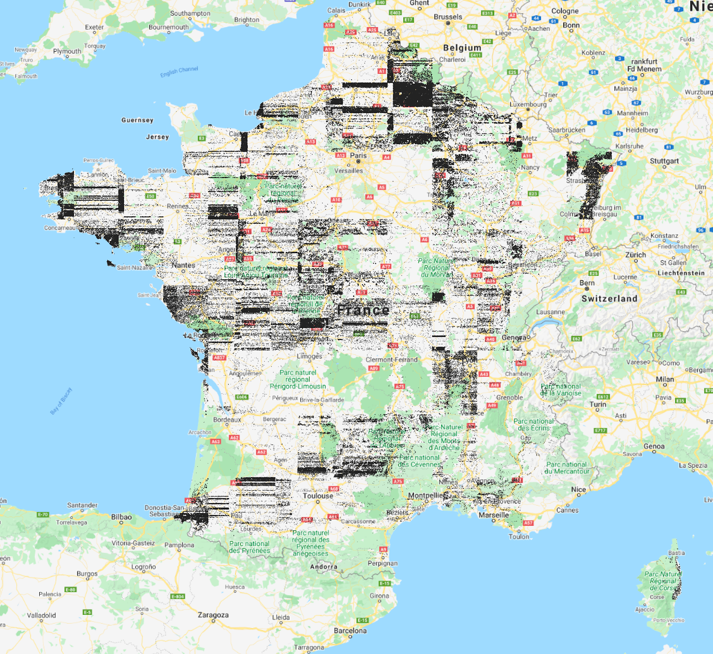

# [Eng] Test task for Python engineer

#  For run the test:
    ```make run_db``` create database
    ```make import_demo_data``` import data to database
    ```make run``` run server
    ```pytest -s -vv test/test_search_endpoints.py``` run tests

<aside>
💡 TLDR: Design and implement the API that allows customers to retrieve geometries from the Database by given parameters.

</aside>

# Requirements

- Python 3.
- PostgreSQL + PostGIS.
- Dockerfile (Solution should be wrapped in a docker container).
- Docker-compose for local testing.
- No restrictions for frameworks and libraries. You can use anything that seems reasonable for this task.
- API documentation that shows how to use it.
- All endpoints should work effectively on any amount of data. The base assumption is that you should store all-world data for at least 4 years. If you have an idea of an interesting but time-consuming implementation, just describe it in words.

Additional:

- Configuration for Kubernetes deployment is highly appreciated.

# Dataset to load in Database

The dataset contains a number of field shapes in France that were generated by ML model.

[The visualization of how the initial dataset looks like.](https://lh4.googleusercontent.com/uj1ciKK7Kq5Z9Fh8_1Y2iISybmUZW47oEXgscG1MJz_bqb5V_pvHEcnQ25CcDxHlAIPe-Rn-mZ6OQmyIl_-_J7Rk_LuNQSByRJdRIYnsWiV_uP5xXWAVt6Pa1yQUebPMlTKYfwbP)

The visualization of how the initial dataset looks like.

This dataset should be used to populate the database. Link to the dataset: https://drive.google.com/file/d/1iystWJQ7nQZf4ZTuRp2YSLqydXzhz6tA/view?usp=sharing.

[fr-subset.geojsons.gz](https://drive.google.com/file/d/1iystWJQ7nQZf4ZTuRp2YSLqydXzhz6tA/view?usp=sharing)

<aside>
💡 Note: The structure of the dataset is GeoJSONSeq. In short, every line of the file is the geometry of the field with attributes.

</aside>

---

## Attributes description

[Untitled Database](https://www.notion.so/fe81d536cc0d4328a3f0261bfcbb3614?pvs=21)

# The task

Design and implement the API that allows customers to retrieve geometries from the Database by given parameters.

Endpoints to implement:

1. Get the set of fields that are "nearby" given point within a given distance. Point and distance are sent by the user. Radius is meant to be in meters.
2. Get the set of fields that are inside the parallelogram with given vertices. Vertices are sent by the user.
3. Get the set of fields that intersect with the requested geometry. Geometry is sent by the user.
4. Get the area, gross yield, and weighted average yield per hectare in a region that was sent by the user. Attribute **region**.

All the parameters that are sent by the user should be picked up from request parameters.

For the task 1-3 also should be implemented the ability to filter the data by the crop.

For the task 1-3 the API should return a valid GeoJSON that should easily be copied to [geojson.io](http://geojson.io) to check the response.

It is assumed that the API won't support the requests that return more than 10000 geometries.

Response example:

```json
{
  "type": "FeatureCollection",
  "features": [
    {
      "type": "Feature",
      "id": 0,
      "geometry": {
        "type": "Polygon",
        "coordinates": ["<list of points>"]
      },
      "properties": {
        "crop": "string",
        "productivity_estimation": 0,
        "region_code": "string",
        "area_ha": 0
      }
    } 
  ]
}
```

Response example for the task 4:

```json
{
  "total_area": 0,
  "total_yield": 0,
  "average_yield": 0
}
```

<aside>
📱 If you have any questions please do not hesitate to reach out to Valerii valerii.tryhubov@cropio.com or Anna anna.tkh@cropio.com

</aside>

---

# Useful links

- [https://geojson.io](https://geojson.io/) — a simple service to visualize geometries.
    
    [geojson.io](https://geojson.io)
    
- [https://geojson.org](https://geojson.org/) — GeoJSON format specification.
    
    [GeoJSON](https://geojson.org)
    
- [https://postgis.net](https://postgis.net/) — PostgreSQL extension to work with GIS data.
    
    [PostGIS](https://postgis.net)
    
- https://geoalchemy-2.readthedocs.io/en/latest/ —  extension for SQLAlchemy to operate with PostGIS types.
    
    [GeoAlchemy 2 Documentation - GeoAlchemy2 0.9.1 documentation](https://geoalchemy-2.readthedocs.io/en/latest/)# geo_data_test
